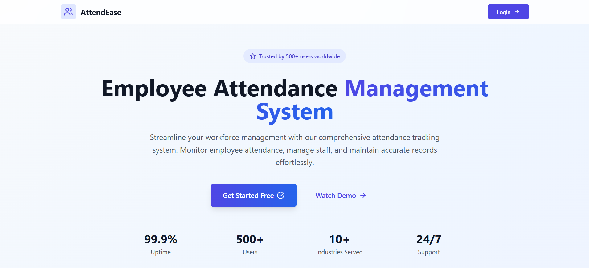

# 🕒 Employee Attendance & Management System

**GitHub:** https://github.com/SimpleCyber  
**Follow me on Twitter for more projects:** [@Satyam_yadav_04](https://x.com/Satyam_yadav_04)

---

## 📌 Overview

This is my **first project for a client** — a fully functional Employee Attendance & Management System that simplifies real-time attendance tracking and employee profile management. Built for small to medium-sized organizations aiming to digitize their workforce operations.

---

## 🚀 Features

- 🔐 **Login & Role-Based Access**  
  Separate portals for Admin and Employees with secure authentication.

- 🕒 **Real-Time Attendance Tracking**  
  Track employee attendance with photo verification and timestamps.

- 👥 **Employee Management**  
  Add, edit, and manage employee profiles with intuitive admin tools.

- 📊 **Dashboard Stats**
  - 99.9% Uptime  
  - 500+ Users  
  - 24/7 Support  
  - 150K+ Attendance Logs

---

## 🛠 Tech Stack

- **Frontend:** React.js, Tailwind CSS  
- **Database & Auth:** Firebase  
- **Deployment:** Vercel  

---

## 🖼️ Screenshot

---

## 📣 Stay Connected

> 🔔 Want to see more such client-ready projects?  
**Follow me on Twitter:** [@Satyam_yadav_04](https://x.com/Satyam_yadav_04)

